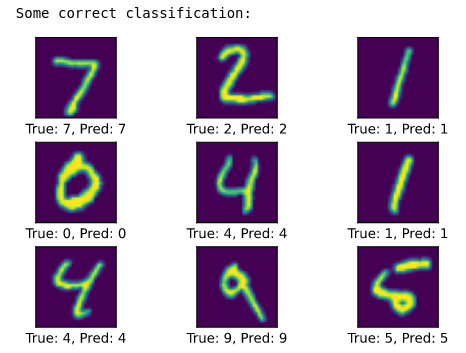
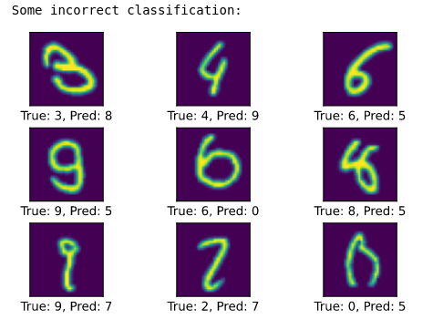

## Introduction

- **CNNumpy** is a Convolutional Neural Network implemented written in pure Numpy (educational purpose only).
- There are 2 implementation versions:
    - Slow: The naive version with nested for loops.
    - Fast: The im2col/col2im version.
- The [naive implementation][naive-implementation] takes around **4 hours for 1 epoch** where the [fast implementation][fast-implementation] takes only **6 min for 1 epoch**  
- **For more details, here are blog posts that explained in depth what's going under the hood for each implementation ([naive][naive-blog] and [fast][fast-blog]).**
- In the [`demo-cnnumpy-fast.ipynb`][demo-notebook] notebook, the im2col/col2im implementation can achieve an accuracy up to  **97.2% in 1 epoch (~6 min)**. Here are some results:





## Installation

- Create a virtual environment in the root folder using [virtualenv][virtualenv] and activate it.

```bash
# On Linux terminal, using virtualenv.
virtualenv myenv
# Activate it.
source myenv/bin/activate
```

- Install **requirements.txt**.

```bash
pip install -r requirements.txt
# Tidy up the root folder.
python3 setup.py clean
```

## Usage of demo notebooks

To play with the `demo-notebooks/` files, you need to make sure jupyter notebook can select your virtual environnment as a kernel.

- Follow **"Installation"** instructions first and make sure your virtual environment is still activated.
- Run the following line in the terminal.
```bash
python -m ipykernel install --user--name=myenv
```
- Run the notebook file **only from `demo_notebooks/`** and then select **Kernel > Switch Kernel > myenv**. You are now ready to go !

<!---
Variables with links.
-->
[naive-implementation]: https://github.com/3outeille/CNNumpy/tree/master/src/slow
[fast-implementation]: https://github.com/3outeille/CNNumpy/tree/master/src/fast
[naive-blog]: https://hackmd.io/@bouteille/ByusmjZc8
[fast-blog]: https://hackmd.io/@bouteille/B1Cmns09I
[demo-notebook]: https://github.com/3outeille/CNNumpy/blob/master/src/demo_notebooks/demo-cnnumpy-fast.ipynb
[virtualenv]: https://packaging.python.org/guides/installing-using-pip-and-virtual-environments/
